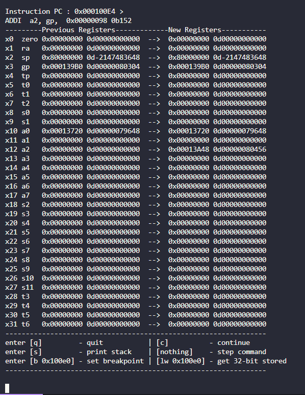
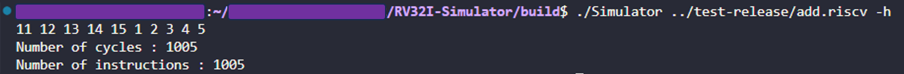

# RV32I Simulator 

## *ELF Compilation* 
  
*Configure your riscv tool-chain- non-supportive of others (but you can expand this simulation for other extensions)*

```
# go to your riscv gnu tool-chain directory
../configure --with-arch=rv32i --prefix=/path/to/riscv32i
make -j$(nproc)

# compile to elf and dump asm code
riscv32-unknown-elf-gcc -march=rv32i add.c lib.c -o add.riscv
riscv32-unknown-elf-objdump -D add.riscv > add.s

```   
*Be aware that this simulator also does not support c stand library*
```
# the lib file gives test library based on my ecall simulation
# if you want to expand to other ecall functionality, please change the ecall function in simulator.cpp

cd test-release
vim lib.c
```


## *Simulation*
*Build the simulator and clear the outputs in test-release*
```
# go to the simulator directory
# please configure your own cmake and build bash file if src is expanded

bash build.sh

#test sequential logic
bash run-test-release.sh

#test pipeline logic
bash run-test-release-pipeline.sh

```

*Simulator mode*  
```
# Sequential by default
cd build
./Simulator ../test-release/one_test_file.riscv

# Pipeline mode 
./Simulator ../test-release/one_test_file.riscv -p

# GDB mode 
./Simulator ../test-release/one_test_file.riscv -s

# history mode
./Simulator ../test-release/one_test_file.riscv -h

# dump mode
./Simulator ../test-release/one_test_file.riscv -d
```

*GDB*
```
# based on the current instruction address and command line to debug
enter [q]          - quit
enter [c]          - continue
enter [s]          - print stack
enter [nothing]    - step command
enter [b 0x100e0]  - set breakpoint 
enter [lw 0x100e0] - get 32-bit stored
```





*History mode*
```
# terminal gives out the number of cycles and instructions

# e.g sequential simulation

```



*Dump mode*
```
# check dump.txt and dump_asm.txt in build/
# dump.txt     - dumped elf file
# dump_asm.txt - dumped implemented instruction (debug decode)
```

## Reference
- Core idea of 5-stage, shout out to the author  
<https://github.com/hehao98/RISCV-Simulator>

- ELFIO repo, detailed reading process  
<https://github.com/serge1/ELFIO/tree/main>

- RV chinese manual, very useful and detail instruction, but chinese only  
<http://riscvbook.com/chinese/RISC-V-Reader-Chinese-v2p1.pdf>

- RV manual, spec 2.2  
<https://riscv.org/wp-content/uploads/2017/05/riscv-spec-v2.2.pdf>

## P.S. Pipeline is not working. 
*C++ is not HDL afterall, and I do not wanna debug anymore :)*